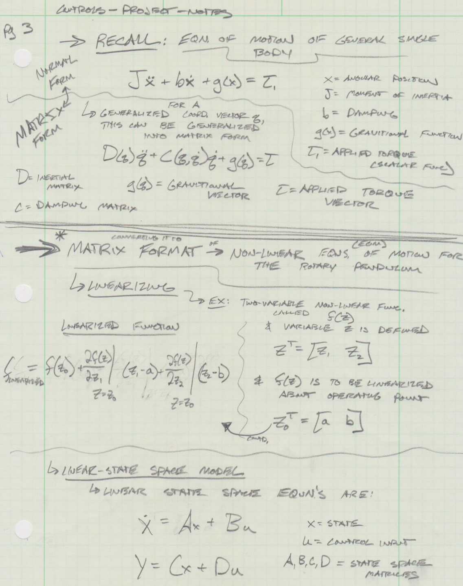
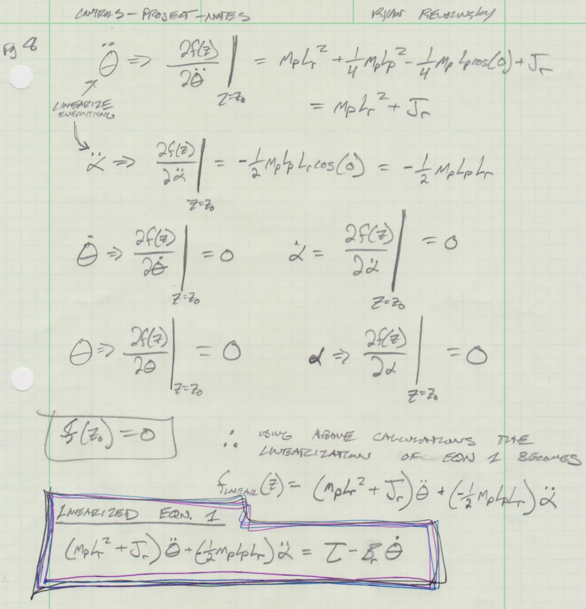
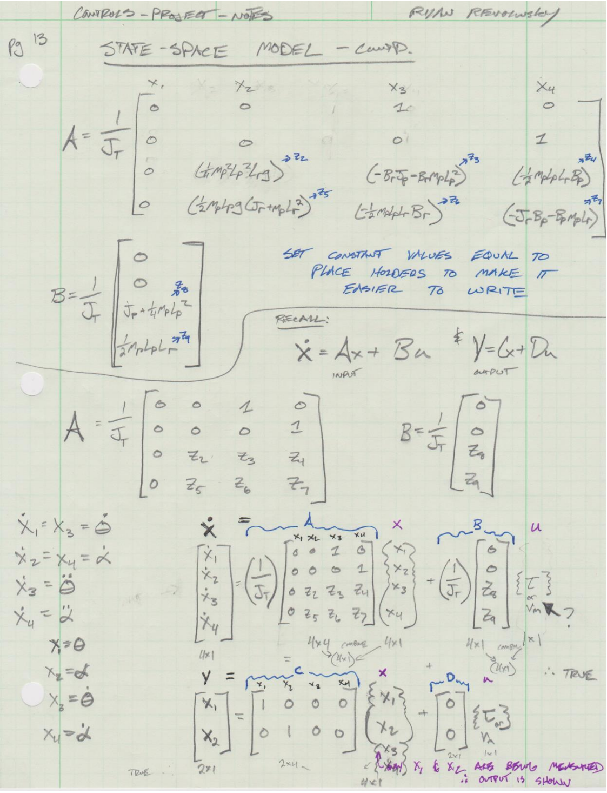
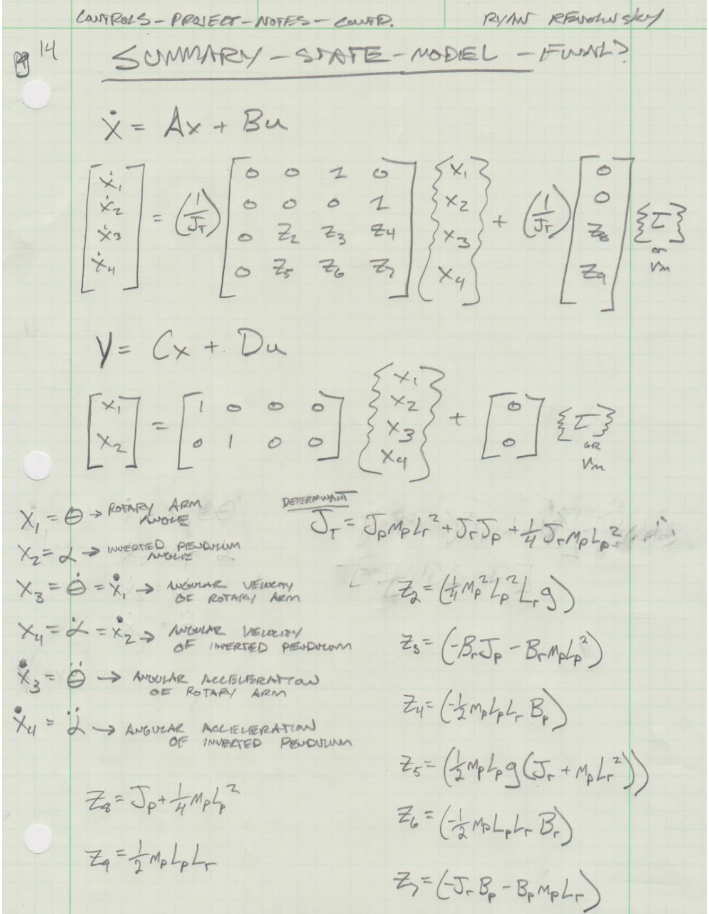

# Meca-482, Furuta Pendulum
#### Group 7
#### Ryan Heinz, Roger Jakobson, Robert Kaufman, Ryan Revolinsky, Brennen Van Voorhees
----------------------------------------------------------------------------------------------------------
#### Table Of Contents
- [1. Overview](#1-Introduction)
- [2. Derivation](#2-Derivation)
- [3. Matlab Code](#3-Matlab-Code)
- [4. Simulink](#4-Simulink)
- [5. Coppelia](#5-Coppelia)
----------------------------------------------------------------------------------------------------------
## 1. Overview

- Project Description - (Note: this was provided to us as a launch point for this project)
“Furuta Pendulum – or rotational inverted pendulum- consists of a driven arm which rotates in the
horizontal plane and a pendulum attached to that arm which is free to rotate in the vertical plane. It was
invented in 1992 at Tokyo Institute of Technology by Katsuhisa Furuta and his colleagues.” [1] The
problem that the team investigates with this project is creating a test platform for control system
algorithms -in a low-cost and streamlined fashion. In that regard, the project team is expected to create
a mathematical model of the system with a designed control system.

Deliverables:
- The team is expected to present their project (~ 5mins) and build a web page which contains all
  deliverables in GitHub.
- The mathematical model of the system must be delivered -preferably in Python or MATLAB.
- The control system should be provided preferable in Simulink, State-flow, or with a high-level
  programming language (e.g., C, C++, or Python). However, the team must show that the control
  algorithm will give the design requirements for the target system. In other words, one cannot
  build the system solely hands-on approach similar to the videos below:
  o Pan and Tilt Mechanism
- The system will have a simulation with the control system and mathematical model by
  connecting Coppelia Sim to MATLAB, Simulink, or whatever the programming landscape is used.
- If the system contains hardware, the design of hardware should consist the necessary
  architectural explanations such as hardware and software relationships.
----------------------------------------------------------------------------------------------------------
## 2. Derivation

The initial derivation to aquire the control equations was done by hand and is depicted below. Under the resources folder is a zip file 
called Courseware Resources.zip which is filled with documentation and initial simulink software from Quanser which was a huge help in
the derivation and building of the simulink model.

Note: The Matlab code supplemented by Quanser was also canabilized to get the base model constraints of the Pendulum. 











----------------------------------------------------------------------------------------------------------
## 3. Matlab Code
```
%% Furuta Pendulum - Setup and Run
% MECA 482 - Spring 2020 - Final Project
% This code sets up the pendulum parameters and runs all the subfunctions
% for coppelia sim to collect and simulate

%% Sets the necessary parameters to run
% See Quanser MATLAB code to find where all constraints where found
% Note: start with: setup_rotpen.m, this will be the guide to the finding of all constraint info

%clear all, close all, clc;
clear;
close all;
clc;
format compact; 

dbstop if error

%% Calibration Data
% Sets the initial angular postion (rads) and the initial angular velocity
% (rad/s) of the arms/links

% theta0 = 0;       
% theta_dot0 = 0;
% alpha0 = 0;
% alpha_dot0 =0;

% Note: the initial conditions in the simulink model start at 0 by default

%% Environment Constraints - Dependent on the Environment the system is in
g = 9.81;           % Gravity - [m/s^2]

%% System Constraints - "Measured" from the Furuta System
% System Configuration: 'ROTARY_ARM' & 'MEDIUM_12IN'
m_p = 0.127;            % Mass of Pendulum Arm - [kg]
m_r = 0.257;            % Mass of Rotor Arm - [kg]

L_p = 0.33655;      % Total Length of Pendulum Arm - [m]
l_p = L_p./2;       % Distance from pivot to center of gravity: calced from experiment - [m]

L_r = 0.2159;                   % Total Length of Rotor Arm - [m]
l_r = (2 + 7/16) * 0.0254;      % Distance from pivot to center of gravity: calced from experiment - [m]

J_p = m_p .* L_p.^2 ./ 12;      % The Moment of Inertia of Pendulum Arm about it's center of Mass (L_p/2) "Approx" - [kg/m^2]
J_r = m_r .* L_r.^2 ./ 12;      % The Moment of Inertia of Rotor Arm about it's center of Mass (L_r/2) - [kg/m^2]

B_r = 113.5e-3;   % Viscous Torque Friction - Similar to Damping
B_p = 0.0024;   % Damping of Pendulum Arm (since their is not actuation on the Pendulum Arm) - [N*m*s/rad]

%% Motor Constraints - Dependent on the motor being used
% High Gear Configuration:
Kgi = 14;       % Internal Gear Ratio (of the Planetary Gearbox)
Kge = 5;        % (1x) 24-tooth gear, (2x) 72-tooth gear, (1x) 120-tooth gear

K_g = Kgi * Kge;                             % Total Gear ratio

Jm_rotor = 3.9e-7;      % Motor Rotor Inertia (kg.m^2)
Jtach = 0;

% Motor Equivalent Inertia (kg.m^2)
    Jm = Jm_rotor + Jtach;

    % External Gears Inertias (kg.m^2)
    % J24: 24-tooth Gear Inertia (on the Motor Shaft)
    m24 = 0.005; % mass (kg)
    r24 = 0.5 / 2 * 0.0254; % radius (m)
    J24 = m24 * r24^2 / 2;
    % J72: 72-tooth Gear Inertia (on the Potentiometer Shaft)
    m72 = 0.030; % mass (kg)
    r72 = 1.5 / 2 * 0.0254; % radius (m)
    J72 = m72 * r72^2 / 2;
    % J120: 120-tooth Gear Inertia (on the Load Shaft)
    m120 = 0.083; % mass (kg)
    r120 = 2.5 / 2 * 0.0254; % radius (m)
    J120 = m120 * r120^2 / 2;

Jg = J24 + 2 * J72 + J120;      % Equivalent moment of inertia including load (kg.m^2)
Beq = 15e-3;                    % Equivalent Viscous Damping Coefficient as seen at the Load (N.m.s/rd)

n_g = 0.9;                                  % Gearbox efficiency
n_m =0.69;                                  % Motor efficiency
k_t = 1.088 * 0.2780139 * 0.0254;           % = .00767 - Motor torque constant - [N*m/A]
R_m = 2.6;                                  % Motor armaturce resistance - [Ohms]
k_m = 0.804 / 1000 * (60 / ( 2 * pi ));     % = .00767 - Back-EMF Constant - [V*s/rad] 

% Set the amplifier Maximum Output Voltage (V) and Output Current (A)
VMAX_AMP = 24;
IMAX_AMP = 4;
K_AMP = 1;

% Potentiometer Sensitivity (rd/V)
K_POT = -(352 * pi / 180 / 10);

% Encoder Resolution, for a quadrature encoder, (rd/count)    
K_ENC = 2 * pi / ( 4 * 1024 );

%% Constants of the System - Derived from Constraints

J_t = (J_p.*m_p.*(L_r.^2)) + (J_r.*J_p) + ((1./4).*J_r.*m_p.*(L_p.^2));     % Determinant of the state space equations

% Constant place holders
z2 = ((1./4).*(m_p.^2).*(L_p.^2).*L_r.*g);
z3 = (-B_r.*J_p - (1./4).*B_r.*m_p.*(L_p.^2));
z4 = ((-1./2).*m_p.*L_p.*L_r.*B_p);
z5 = ((1./2).*m_p.*L_p.*g.*(J_r + m_p.*(L_r.^2)));
z6 = ((-1./2).*m_p.*L_p.*L_r.*B_r);
z7 = (-J_r.*B_p - B_p.*m_p.*L_r.^2);
z8 = (J_p + (1./4).*m_p.*(L_p.^2));
z9 = ((1./2).*m_p.*L_p.*L_r);

V_m_modifier = (n_g .* K_g .* n_m .* k_t)./(R_m);

%% State Space Representation - Build Open Loop Response
% Add here linearized system model instead of zero
A = zeros(4);       % Creates Empty 4x4 Matrix - A = System Matrix
A(1,3) = 1;
A(2,4) = 1;
A(3,2) = (1./J_t) .* z2;
A(3,3) = (1./J_t) .* z3;
A(3,4) = (1./J_t) .* z4;
A(4,2) = (1./J_t) .* z5;
A(4,3) = (1./J_t) .* z6;
A(4,4) = (1./J_t) .* z7;

% Add here input vector instead of zero
B = zeros(1,4)';    % Creates Empty 1x4 Matrix - B = Input Matrix
B(3,1) = V_m_modifier .* (1./J_t) .* z8;
B(4,1) = V_m_modifier .* (1./J_t) .* z9;

% Shows we have two outputs
C = zeros(2,4);       % Creates Empty 4x4 Matrix - C = Output Matrix - Should it be 4x4? or 2x4?
C(1,1) = 1;
C(2,2) = 1;

D = zeros(1,2)';    % Creates Empty 1x4 Matrix - D = Feedforward matrix - Should it be 1x4 or 1x2?

% Add actuator dynamics (if you would consider to add)
A(3,3) = A(3,3) - K_g.^2.*k_t.*k_m./R_m.*B(3); 
A(4,3) = A(4,4) - K_g.^2.*k_t.*k_m./R_m.*B(4); 
B = K_g * k_t * B / R_m;

% Labels the soon to be generated SS Model
states = {'x1','x2','x3','x4'};
inputs = {'V_m'};
outputs = {'theta','alpha'};

% Load into state-space system
% Open loop system model
Furuta_ss = ss(A,B,C,D,'Statename', states,'InputName',inputs,'OutputName',outputs)

% Provides the size of the State Space model, the # of inputs, outputs and states
size(Furuta_ss)

% Determines the Stability of this System :1 Means the system is stable, 0 means it is unstable
Stability_F_ss = isstable(Furuta_ss)       
% Note: This is an underactuated system, therefore, it will be unstable

% Determines the Controllability Matrix of the State-space LTI Object
Con_F_ss = ctrb(A,B);   % The system is controllable if Con_F_ss has a full rank n

% Determines the number of uncontrollable states - checking if it has full rank
unCon_number_states = length(A) - rank(Con_F_ss);
% Note: The un_Con_number_states = 0, therefore the SS LTI Model is full
% rank and is thus a controllable system

% Determines the Observability Matrix os the SS Model
Obs_F_ss = obsv(A,C);   % The model is observable if Obs_F_ss has a full rank n
% Note: The Obs_F_ss = 0, therefore the SS Model is full
% rank and is thus an observable system

% Number of unobservable states
unObs_num_states = length(A) - rank(Obs_F_ss);

% Provides the Transfer Function of the System in Laplace (s-domain)
Furuta_laplace = tf(Furuta_ss)               

% Cross Checking the poles of the functions with plot
Pole = pole(Furuta_ss)

% Creates a pole zero map of the State Space Model
figure(1);
h = pzplot(Furuta_ss);    % the x indicates a pole and o indicates a zero
grid on;

% Places the above plotted zeros and poles into a column vector
[p,z] = pzmap(Furuta_ss);   

% Computes and plots the poles and zeros of each input/output pair of the dynamic system model
figure(2);
h2 = iopzplot(Furuta_ss);
% For whatever reason the zeros are ploted in this setup, I do not know why

%% Add Controller - %% Pole Placement via Transformation - Balance Control
% Balance control (small angle approx.)
% Using the state space model of the system above, we can attempt to
% calculate an appropriate gain matrix of K

% A and B are the state matrices from before
% p is the vector that contians the desired locat. of the closed loop poles

% K is the State-Feedback gain matrix - the eigenvalues of A-BK match the
% entries of p (up to the ordering)
% K = place(A,B,p);

% Control Specifications - Control and time-respones requirements
% Aquired from Quanser documentation
zeta = 0.7;         % Damping Ratio
wn = 4;             % Natural frequency - [rad/s]

% Intermediate calculations for finding desired pole placement
sigma = zeta .* wn;
wd = wn .* (sqrt(1 - (zeta.^2)));

% Balance control enable range (rad)
epsilon = 12.0 * pi / 180;

% Choosen closed-loop poles - placed along the real-axis to the left of the
% dominant poles
p3 = -30;
p4 = -40;

% Calculated Complex conjugate dominant poles
p1 = complex(-sigma,wd);    %p1 = -sigma + wd j;
p2 = complex(-sigma,-wd);   %p2 = -sigma - wd j;

desired_poles = [p1 p2 p3 p4];      % Assembles desired pole placement

[K, prec, message] = place(A,B,desired_poles);       % Calculates Controller Gains

% Note: prec tells how closely the eignevalues of A-B*K match the spcified
% locations p (prec measures the number of accurate decimal digits in the
% actual closed-loop poles). If some nonzero closed-loop pole is more than
% 10% off from the desired location, "message" will contain a warning
% message.

%% Plot Closed Loop Result - Control Design via Transformation
% Similar to Ex. 12.4 out of the textbook
% Form the compensated State space matrices using the controller gain
Anew = A - B*K;     
Bnew = B;
Cnew = C;
Dnew = D;

Tss = ss(Anew, Bnew, Cnew, Dnew);   % Forms a LTI (Linear Time Invariant) State-Space Object
T = tf(Tss);                        % Create T(s) - Transformed Model;
T = minreal(T);                     % Cancel common terms and display T(s)

new_poles = pole(T);     % Displays the poles of T

% Plot the compensated step response of the closed-loop transfer function
figure(10);
step(Tss)
title('Compensated Step Response');

% Calculated parameters 
[Knew, prec_new, message_new] = place(Anew,Bnew,desired_poles);       % Calculates new Controller Gains - not really nec?

%% Swing-up Control
% Use energy based solution from [Underactuated Robotics, MIT]

% SRV02 High-pass filter in PD control used to compute velocity
% Cutoff frequency (rad/s)
wcf_1 = 2 * pi * 10.0;
% Pendulum High-pass filter in PD control used to compute velocity
% Cutoff frequency (rad/s)
wcf_2 = 2 * pi * 10.0;

% Pulling data from SS Model
alpha = C(2,2);
theta = C(1,1);

% Tunable inverted pendulum angle
% Balance control enable range (rad)
% epsilon = 12.0 * pi / 180;

% Potential Energy of Pendulum (J) - When hanging in the downward position
Ep_hanging_position = 0;                %(1./2).*m_p.*g.*L_p.*(1 - cos(alpha))         

% Potential Energy of Pendulum (J) - When Standing Upright
Ep_upright_position = m_p.*g.*L_p;      %(1./2).*m_p.*g.*L_p.*(1 - cos(alpha))         alpha = pi -> upright position

% Kinetic Energy of Pendulum (J)
%Ek = (1./2).*J_p.*(alpha_dot.^2);

% Total Energy of Pendulum (J) - Break free for hanging resting position - 
% assume E = 0 because we are not moving much, just trying to get the 
% pendulum started moving so the swing up control begins to function, the
% swing up control will not start moving if the pendulum is motionless
E_tot = 0;

% Max Torque of the Motor - Based on SRV02 Motor Parameters from Quasner
T_max = (n_g.*K_g.*n_m.*k_t.*(5))./R_m; 
% Note: Assumption is the max applied voltage to the DC motor is 5, hence
% where the 5 came from in the above equation, replacing Vm

% Maximum acceleration of pivot (m/s^2) - Needs max torque of motor
a_max = T_max./(m_r.*L_r);

% Tunable Control Gain
mu = 1;

% Reference Energy (J)
Er = Ep_upright_position;

% Function that saturates the control signal at max acceleration of pendulum pivot (u_max)
sat_u_max = 20;

%% Connecting MATLAB to Coppelia
% Note: 4 API files need to be in the directory of the folder for API's to
% correctly connect MATLAB to Coppelia, see documentation 

% Initialize API
sim=remApi('remoteApi');

% Using the prototype file (remoteApiProto.m)
sim.simxFinish(-1);

% Note: Just in case, close all opened connections
clientID=sim.simxStart('127.0.0.1',19999,true,true,5000,5);

if (clientID>-1)
    
    disp('Connected to remote API server');                     
    set_param('Furuta_Pendulum_Model_Revolinsky_V4', 'SimulationCommand', 'start')               

    %sim.simxSetJointTargetVelocity(clientID,j1,pos_val,sim.simx_opmode_streaming);
    
    while(1)  % In this while loop, we will have the communication
        
        % Step 1: Initialize Joint and Link Handles where you defined your joints and links under the set coppelia names
        [err_code_1_object, J1] = sim.simxGetObjectHandle(clientID,'J1',sim.simx_opmode_blocking);
        [err_code_2_object, J2] = sim.simxGetObjectHandle(clientID,'J2',sim.simx_opmode_blocking);
        [err_code_3_object, L2] = sim.simxGetObjectHandle(clientID,'L2',sim.simx_opmode_blocking);
        [err_code_4_object, L3] = sim.simxGetObjectHandle(clientID,'L3',sim.simx_opmode_blocking);
                %%if errorCode is not vrep.simx_return_ok, this does not mean there is an error:            
                %%it could be that the first streamed values have not yet arrived, or that the signal            
                %%is empty/non-existent  
                
% Sensor Data from Coppelia
        [err_code_1_position, theta_J1] = sim.simxGetJointPosition(clientID, J1 , sim.simx_opmode_streaming);
        [err_code_2_position, alpha_J2] = sim.simxGetJointPosition(clientID, J2 , sim.simx_opmode_streaming);
        [err_code_1_velocity, linear_velo_theta, theta_dot_J1] = sim.simxGetObjectVelocity(clientID, L2 ,sim.simx_opmode_streaming);
        [err_code_2_velocity, linear_velo_alpha, alpha_dot_J2] = sim.simxGetObjectVelocity(clientID, L3 ,sim.simx_opmode_streaming);
        
        theta_dot_about_z = theta_dot_J1(3);
        alpha_dot_about_x = alpha_dot_J2(1);
        alpha_dot_about_y = alpha_dot_J2(2);
        
                 pause(.01);
                
% Actuator Data from Simulink
            % We receive the sensor data from Simulink model 'Furuta_pendulum_model' and 'To Workspace theta' block via RuntimeObject
            theta_s = get_param('Furuta_Pendulum_Model_Revolinsky_V4/To Workspace theta','RuntimeObject');
            theta_s.InputPort(1).Data;    % Receive the data
            %simout_t = sim('Furuta_Pendulum_Model_Revolinsky_V4/To Workspace theta','SimulationMode','normal', 'SaveState','on','StateSaveName','xoutNew','SaveOutput','on','OutputSaveName','youtNew');
            %theta_s = simout_t.get('youtNew');
            %assignin('base','theta_s',theta_s);

            
            % We receive the sensor data from Simulink model 'Furuta_pendulum_model' and 'To Workspace theta' block via RuntimeObject
            alpha_s = get_param('Furuta_Pendulum_Model_Revolinsky_V4/To Workspace alpha','RuntimeObject');
            alpha_s.InputPort(2).Data;    % Receive the data
            %simout_a = sim('Furuta_Pendulum_Model_Revolinsky_V4/To Workspace alpha','SimulationMode','normal');
            %alpha_s = simout_a.get('alpha_s');
            %assignin('base','alpha_s',alpha_s);
            
% Coppelia motion dictated by Simulink model - Will uncomment when I manage to get simulink to write to the work space
        % Note: Unknown if this code is correct couldn't get past simulink 'to workspace' block error (dot indexing error) so couldn't get to debug coppellia sim motion
            [err_code_1_set_target_position] = sim.simxSetJointTargetPosition(clientID, J1, theta_s, sim.simx_opmode_streaming);
            [err_code_2_set_target_velocity] = sim.simxSetJointTargetVelocity(clientID, J1, theta_dot_s, sim.simx_opmode_streaming);
            
   end
end
```
----------------------------------------------------------------------------------------------------------
## 4. Simulink
----------------------------------------------------------------------------------------------------------
## 5. Coppelia


----------------------------------------------------------------------------------------------------------
## 6. Results
